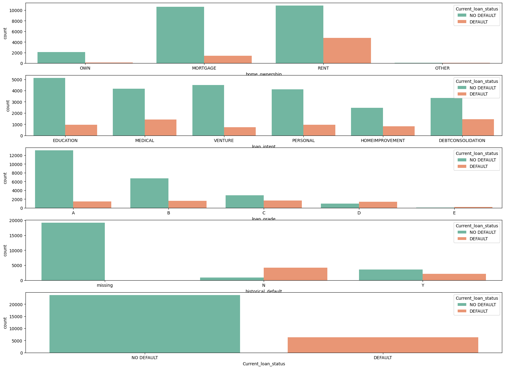
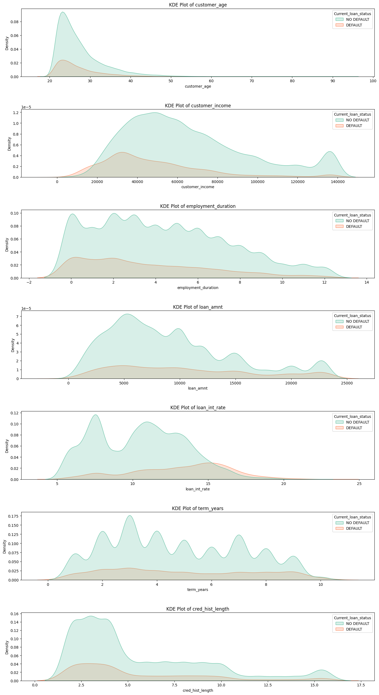

# Análise de Dados : Insights sobre Inadiplência 

A etapa de Análise de Dados tem como objetivo principal entender a fundo o *dataset* de empréstimos, preparando-o para a modelagem preditiva. Para isso, as colunas foram organizadas em variáveis numéricas contínuas e categóricas, o que permite uma abordagem de análise e pré-processamento mais direcionada e eficaz.

## Insights sobre Variáveis Categóricas 

#### Perguntas sobre Variáveis Categóricas:
* Qual é a relação entre a situação de moradia do cliente (**RENT**, **MORTGAGE**, **OWN**) e a taxa de inadimplência (**DEFAULT**)?
* A finalidade do empréstimo (**EDUCATION**, **DEBTCONSOLIDATION**, **VENTURE**, etc.) tem alguma correlação com o risco de *default*?
* Existe uma relação monotônica entre a nota de crédito (**A** a **E**) e a inadimplência? Em quais faixas a taxa de *default* acelera?
* O histórico de crédito prévio (**Y/N**) impacta a chance de inadimplência? O comportamento do grupo com dados faltantes é atípico?

1.  Clientes RENT têm maior taxa de DEFAULT do que MORTGAGE e OWN?

  **Insights do gráfico**:

  - **MORTGAGE** domina em volume e aparenta menor fração de DEFAULT.

  - **RENT** mostra proporção visualmente maior de DEFAULT.

  - **OWN** intermediário; OTHER é raro.

---

2.  A finalidade do empréstimo se relaciona ao risco? Quais intents têm maior taxa de DEFAULT?

  **Insights do gráfico**:

  - **EDUCATION e DEBTCONSOLIDATION** concentram volume.

  - **VENTURE e PERSONAL** sugerem fração maior de DEFAULT.

---
3.  Existe relação monotônica entre nota (A→E) e inadimplência? Em que faixa a taxa acelera?

  **Insights do gráfico**:

  - **A** tem alto volume e menor parcela de **DEFAULT**.

  - **C/D/E** exibem mais DEFAULT proporcionalmente (mesmo com menos casos).

---
4. Ter histórico prévio (Y) aumenta a chance de DEFAULT? O grupo “missing” tem comportamento atípico?

**Insights do gráfico**:

  - “missing” é massivo e majoritariamente **NO DEFAULT** (pode indicar viés de coleta).

  - Diferença entre **Y** e **N** não é óbvia visualmente.

---
5.  O desbalanceamento (~79% NO DEFAULT vs ~21% DEFAULT) exige class weights/reamostragem e muda a métrica ideal?

  **Insights do gráfico**:

  - Forte desbalanceamento de classes.

  - **Ação/validação**: split estratificado, class weights ou SMOTE/Under; priorizar ROC-AUC, PR-AUC, Recall/F1 da classe DEFAULT.

## Insights sobre Variáveis Númericas

#### Perguntas sobre Variáveis Numéricas:
* **Clientes mais jovens** apresentam uma maior taxa de *default*?
* **Rendas mais baixas** concentram uma maior probabilidade de inadimplência?
* **Menor tempo de emprego** do cliente aumenta a chance de *default*?
* **Valores de empréstimo mais altos** implicam maior probabilidade de inadimplência?
* **Taxas de juros mais altas** aumentam o risco de o cliente se tornar inadimplente?

1. **Clientes mais jovens apresentam maior taxa de DEFAULT?**  

**Insights do gráfico**:  
- A curva de **DEFAULT** aparece mais concentrada na faixa **20–28 anos**.  
- **NO DEFAULT** se distribui em idades mais amplas.  
- Há outliers em idades muito altas (até 100), que devem ser tratados.  

---

2. **Rendas mais baixas concentram maior probabilidade de DEFAULT?**  

**Insights do gráfico**:  
- Forte **assimetria**: a maior parte dos clientes está abaixo de **80k de renda**.  
- A densidade de **DEFAULT** é maior nas faixas de **baixa renda**, enquanto **NO DEFAULT** se estende a valores mais altos.  
- Recomenda-se **transformação logarítmica** (`log1p`) e análise de outliers.  

---

3. **Menor tempo de emprego aumenta a chance de DEFAULT?**  

**Insights do gráfico**:  
- Clientes com **0–3 anos de emprego** têm densidade maior de **DEFAULT**.  
- **NO DEFAULT** se distribui mais ao longo dos anos de experiência.  
- Valor **0** pode representar tanto “sem emprego” quanto **dados faltantes codificados**.  

---

4. **Valores maiores de empréstimo aumentam a chance de DEFAULT?**  

**Insights do gráfico**:  
- A distribuição é bastante **assimétrica**, com concentração de empréstimos até **15k**.  
- **DEFAULT** tem maior presença em faixas **mais baixas**, mas com sobreposição.  
- Cauda longa até **250k**, exigindo **capping** ou transformação.  

---

5. **Taxas de juros mais altas implicam maior probabilidade de DEFAULT?**  

**Insights do gráfico**:  
- A curva de **DEFAULT** é mais densa acima de **13% de taxa de juros**.  
- **NO DEFAULT** tem maior concentração entre **7–12%**.  
- `loan_int_rate` parece ser **variável relevante para risco**.  
