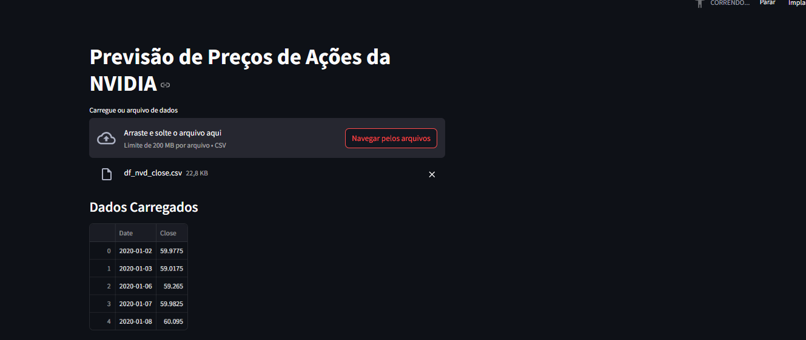
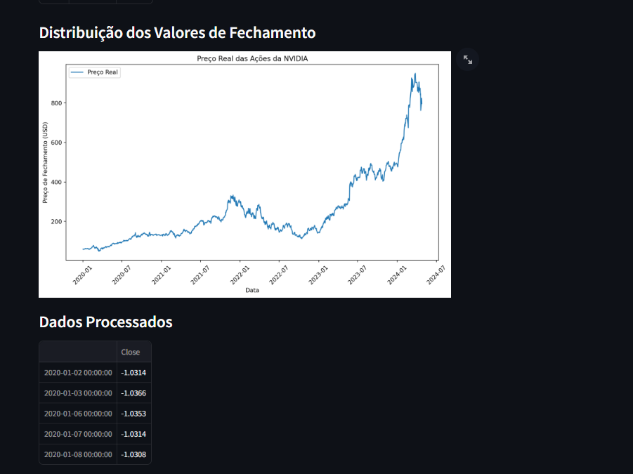
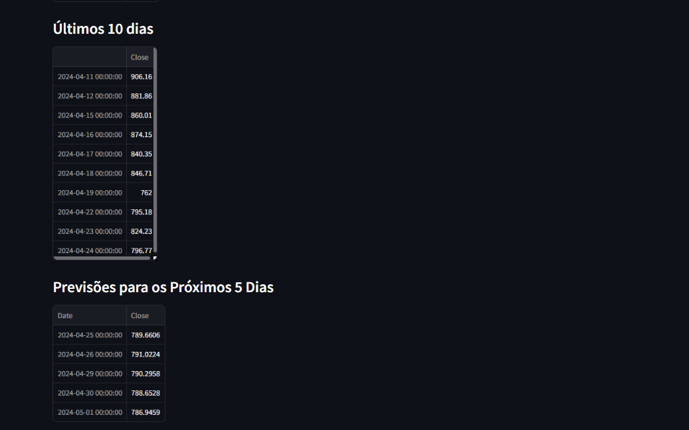
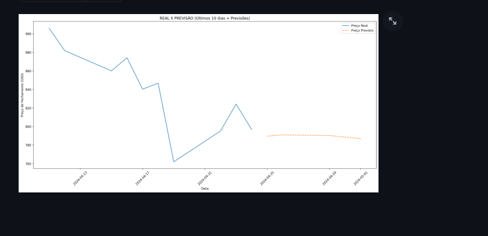

# Deep Learning: Previsão de Preços da NVIDIA

O mercado financeiro é altamente dinâmico e volátil, com preços de ações flutuando com base em uma série de fatores econômicos, políticos e sociais. Prever esses preços, especialmente no caso de ações específicas, como as da NVIDIA, é um grande desafio. Investidores e analistas financeiros dependem de previsões precisas para tomar decisões informadas. A tarefa de prever o preço de fechamento das ações, com base em dados históricos, é complexa, mas crucial para estratégias de investimento.

## Contribuição de Redes Neurais

A Ciência de Dados fornece ferramentas poderosas para lidar com dados temporais e realizar previsões de séries temporais, como a previsão de preços de ações. Modelos de Deep Learning, como as redes neurais recorrentes (RNNs), são ideais para esse tipo de tarefa, pois são capazes de aprender e capturar dependências temporais complexas em grandes volumes de dados. A Ciência de Dados contribui ao transformar dados históricos em previsões futuras, permitindo uma análise automatizada e otimizada do comportamento das ações e ajudando investidores na análise de tendências e na minimização de riscos.

## Objetivo do Projeto

Este projeto tem como objetivo desenvolver um modelo de **Deep Learning** para prever o **preço de fechamento das ações da NVIDIA** com base em dados históricos. A previsão de preços de ações é uma das aplicações mais populares de **séries temporais** e **redes neurais recorrentes**. Através da análise de dados passados, o modelo será capaz de prever os preços futuros, fornecendo insights valiosos para decisões financeiras.

## Redes Neurais Recorrentes

O modelo desenvolvido utiliza **Redes Neurais Recorrentes (RNN)**, com foco em **LSTM (Long Short-Term Memory)**, que é uma variação das RNNs e é especialmente eficaz para o processamento de dados sequenciais, como as séries temporais. As redes LSTM são capazes de capturar dependências temporais de longo prazo, o que é fundamental para a previsão de preços de ações. O modelo é composto por três camadas LSTM, uma camada de dropout para prevenir overfitting, e uma camada densa para gerar a previsão final. O treinamento do modelo é realizado com base nos dados históricos, e as previsões são feitas para os dias subsequentes com base nas últimas observações.


## Tecnologias Utilizadas

- **Python**: A linguagem de programação principal para desenvolvimento e treinamento do modelo de Deep Learning.
- **TensorFlow/Keras**: Frameworks utilizados para construir e treinar a rede neural.
- **Pandas**: Biblioteca para manipulação e análise de dados.
- **NumPy**: Biblioteca para operações matemáticas e manipulação de arrays.
- **Matplotlib/Seaborn**: Bibliotecas para visualização de dados e gráficos.


### Arquitetura do Modelo

- **Camadas LSTM**: Três camadas LSTM são usadas para aprender as dependências temporais dos dados. Duas dessas camadas retornam sequências, permitindo que a rede neural aprenda padrões mais complexos.
- **Camada de Dropout**: Uma camada de dropout é inserida para prevenir **overfitting** e garantir que o modelo generalize bem para novos dados.
- **Camada Densa**: A camada densa final gera a previsão do preço de fechamento para o próximo dia com base nas entradas fornecidas.


## Estrutura das Pastas do Projeto

```bash
RNN-NVIDIA/
├── app/
│   ├── app.py               # Interface com Streamlit para envio de CSV e visualização dos resultados
│   ├── preprocessing.py             # Funções de pré-processamento e tratamento do CSV
│   ├── model.py  #Funções Usadas para Previsão de Dados apartir de Dados Recorrentes
├── models/
│   ├── modelo_lstm.h5      # Modelo de Rede Neural para Previsão de Valores
│   ├── scaler.pkl  # Modelo Scaler 
├── imagens/
│   ├── *.png  #Imagens Usadas para Análise Exploratória  & Streamlit 
├── data/                   # Exemplos de arquivos CSV para treino e validação
│   ├── NVIDIA.csv     # Arquivo usado para treinamento dos modelos
│   ├── nvidia_validation.csv   # Arquivo usado para validação do modelo e teste na aplicação
├── reports/                # Relatórios e análises do projeto
│   ├── analytics_exploratory.md   # Insights sobre Análise Exploratória
│  
├── notebook/                # Execução do Treinamento do Modelo Neural 
│   ├── lstm_nvidia.ipynb       # Arquivo do Jupyter Usado para Contsrução do Modelo Neural
└── README.md               # Este documento
```

## [Análise Exploratória de Dados](./reports/analytisc_exploratory.md)

A **análise exploratória de dados (EDA)** foi realizada para entender melhor o comportamento dos dados de preços de ações da NVIDIA. Durante a EDA, foram investigadas as colunas mais relevantes, como a "Date" e "Close", e realizadas visualizações para identificar padrões temporais e tendências. Através dessa análise, foi possível avaliar a distribuição dos dados, detectar possíveis anomalias e garantir que os dados estivessem prontos para o pré-processamento e treinamento do modelo de previsão.

Com isso, a EDA ajudou a configurar a base necessária para a construção de um modelo de previsão preciso, permitindo uma análise mais aprofundada do desempenho das ações da NVIDIA ao longo do tempo.

**Questões Abordadas**
1. Qual é a relação entre o preço de abertura (Open) e o preço de fechamento (Close) das ações da NVIDIA?
2. Como o preço das ações (Open, High, Low, Close) varia ao longo do tempo?
3. Como os preços de fechamento (Close) variam ao longo dos anos?
4. Existe alguma sazonalidade ou padrão específico nas variações diárias de preço (Open, High, Low, Close) em determinados meses ou anos?

    

## Resultados 

- **Erro Quadrático MSE**: O valor de 0.0115 indica que o modelo está fazendo boas previsões, com erros médios pequenos. A medida não é muito alta, o que sugere que o modelo tem um desempenho razoável para a tarefa de previsão.

- **R² (Coeficiente de Determinação)**: O valor de 0.9897 indica que o modelo explica 98.96% da variabilidade nos dados, o que é um excelente resultado.

- **Modelo de Previsão de Preços**: Um modelo de Deep Learning treinado para prever o preço de fechamento da ação da NVIDIA nos próximos dias.
- **Análise de Desempenho**: Uma análise das métricas do modelo, incluindo **erro de treinamento**, **erro de validação** e **precisão das previsões**.


## Execução do Streamlit


1. **Instalação do Streamlit**:
   Para rodar a aplicação, você precisa ter o Streamlit instalado em seu ambiente. Caso ainda não tenha o Streamlit instalado, basta rodar o seguinte comando:
   
   ```bash
   pip install streamlit
   ```
2. **Estrutura do Código**

    - O arquivo principal da aplicação é o ``app.py``. Neste arquivo, utilizamos o Streamlit para:

    - Exibir a interface interativa para o usuário enviar os dados.

    - Processar os dados enviados e gerar previsões com o modelo LSTM.

    - Exibir gráficos e tabelas com os resultados.

3. **Fluxo do `app.py`**
- Carregamento do Modelo:
 O modelo pré-treinado é carregado com a função load_model do Keras.

- Carregamento do CSV:
 O usuário faz o upload de um arquivo CSV contendo os dados históricos das ações da NVIDIA. Esse arquivo é carregado no Streamlit com a função st.file_uploader.

- Exibição de Dados:
 Após o upload, o DataFrame do CSV é exibido na interface do usuário, permitindo que o usuário veja as primeiras linhas do conjunto de dados.

 

- Pré-processamento dos Dados:
Uma função preprocess_data é utilizada para limpar e normalizar os dados, bem como configurar o índice para trabalhar com as séries temporais.



- Previsões com o Modelo:
O modelo LSTM faz a previsão dos preços de fechamento das ações da NVIDIA com base nos últimos 10 dias de dados históricos.



- Exibição de Gráficos:
Utilizando matplotlib, geramos gráficos de comparação entre os preços reais e previstos. O Streamlit exibe esses gráficos interativamente.



4. Comando para Executar o Streamlit
Após salvar o arquivo app.py, basta rodar o seguinte comando no terminal para iniciar o servidor do Streamlit:

```bash
streamlit run app.py

```

## Conclusão

O projeto de **previsão de preços da NVIDIA** utilizando Deep Learning busca explorar o potencial de **redes neurais** para **prever séries temporais** financeiras. Através do uso de **LSTM**, conseguimos construir um modelo robusto que aprende padrões temporais e fornece previsões precisas para os próximos dias. Esse projeto pode ser expandido para incluir outros ativos financeiros e ser integrado em **sistemas de decisão financeira**.
