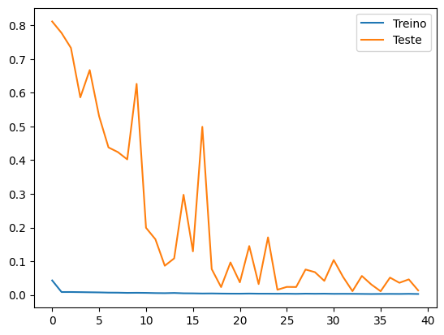

# Previsão do Preço de Ações da NVIDIA

## Sobre o Projeto

Este projeto visa utilizar técnicas de **Deep Learning** para prever o **preço de fechamento das ações da NVIDIA** com base em dados históricos. A abordagem usa redes neurais recorrentes, especificamente **LSTM (Long Short-Term Memory)**, para fazer previsões de séries temporais. O modelo é treinado com dados históricos de preços de ações e faz previsões para os próximos dias com base no comportamento passado das ações.

O objetivo principal é prever o preço de fechamento das ações para os próximos cinco dias com base nos dados fornecidos.

## Bibliotecas Usadas

As principais bibliotecas utilizadas neste projeto são:

- **Pandas**: Para manipulação e pré-processamento dos dados.
- **NumPy**: Para operações numéricas.
- **Matplotlib/Seaborn**: Para visualização de gráficos e resultados.
- **TensorFlow/Keras**: Para a construção e treinamento do modelo de rede neural.
- **Scikit-Learn**: Para a normalização dos dados.

## Etapas do Projeto

O projeto segue as seguintes etapas:

1. **Carregamento de Dados**: O arquivo CSV contendo os dados históricos de preços das ações da NVIDIA é carregado e as colunas "Date" e "Close" são extraídas.
2. **Pré-processamento dos Dados**: A coluna "Date" é convertida para o formato datetime e definida como índice. Em seguida, a coluna "Close" é normalizada utilizando o `StandardScaler` para facilitar o treinamento do modelo.
3. **Construção do Modelo**: O modelo LSTM (Long Short-Term Memory) é configurado e treinado com os dados históricos.
4. **Previsões**: O modelo realiza previsões para os próximos 5 dias com base nos últimos 10 dias de dados.
5. **Avaliação**: As previsões são avaliadas e comparadas com os valores reais utilizando métricas como MSE (Erro Quadrático Médio), MAE (Erro Absoluto Médio) e R² (Coeficiente de Determinação).

## Construção da Rede Neural: Arquitetura

A arquitetura da rede neural é composta por:

- **Camadas LSTM**: Três camadas LSTM são usadas para aprender as dependências temporais dos dados. Duas dessas camadas retornam sequências, permitindo que a rede neural aprenda padrões mais complexos.
- **Camada de Dropout**: Uma camada de dropout é inserida para prevenir **overfitting** e garantir que o modelo generalize bem para novos dados.
- **Camada Densa**: A camada densa final gera a previsão do preço de fechamento para o próximo dia com base nas entradas fornecidas.

## Resultados e Métricas

As métricas utilizadas para avaliar o modelo incluem:

- **MSE (Mean Squared Error)**: Mede o erro quadrático médio entre os valores reais e as previsões.
- **MAE (Mean Absolute Error)**: Mede o erro absoluto médio entre os valores reais e as previsões.
- **R² (Coeficiente de Determinação)**: Avalia a qualidade do ajuste do modelo aos dados, indicando o quanto das variáveis independentes explicam a variabilidade da variável dependente.

Essas métricas ajudam a avaliar a eficácia do modelo e fornecem uma ideia sobre a precisão das previsões feitas para os preços das ações## Resultados Obtidos

### **Desempenho do Modelo**

A seguir, apresentamos as métricas que avaliam o desempenho do modelo, bem como a comparação entre as **previsões feitas** e os **valores reais**.

### **Métricas de Avaliação**:
- **MSE (Erro Quadrático Médio)**: 0.0115  
  O **MSE** mede a média dos erros quadráticos, sendo uma métrica importante para avaliar a magnitude do erro. O valor baixo de MSE sugere que o modelo foi capaz de prever os preços de maneira razoavelmente precisa.

- **MAE (Erro Absoluto Médio)**: 0.0733  
  O **MAE** indica o erro médio absoluto entre as previsões e os valores reais. O valor de **0.0749** sugere que o erro médio é relativamente pequeno, mas ainda existe uma margem de melhoria.

- **R² (Coeficiente de Determinação)**: 0.9897  
  O **R²** é uma métrica que indica a proporção da variabilidade nos dados explicada pelo modelo. Um valor de **0.9897** indica que o modelo tem uma **excelente capacidade de explicação**, ou seja, **98.97%** da variabilidade dos preços de fechamento é explicada pelo modelo.

 - **Análise de Loss**

 
 
 - **Linha azul (Treinamento)**: Representa o comportamento da função de perda durante o treinamento do modelo. No início, o valor da perda é relativamente alto, mas diminui rapidamente à medida que o modelo aprende a partir dos dados de treinamento, ajustando seus parâmetros (como os pesos nas camadas da rede neural).
  
- **Linha laranja (Teste)**: Mostra a evolução da função de perda para os dados de teste, ou seja, os dados que o modelo não viu durante o treinamento. Inicialmente, a perda do modelo nos dados de teste é maior, mas ao longo das iterações, a perda começa a se estabilizar, o que indica que o modelo está generalizando melhor.

- **Observações Importantes**: 
    - A queda acentuada da linha azul nas primeiras iterações sugere que o modelo está aprendendo rapidamente e se ajustando aos dados de treinamento.
    - A linha laranja, que representa a perda nos dados de teste, é mais instável no início. Isso pode indicar que o modelo não está se ajustando bem aos dados de teste inicialmente, mas está melhorando ao longo do treinamento.
    - Este gráfico pode ser usado para diagnosticar se o modelo está sofrendo de **overfitting** (quando a perda no conjunto de teste começa a crescer enquanto a perda no treinamento diminui muito), o que indica que o modelo está memorizando os dados em vez de generalizar bem para novos dados.

### **Comparação dos Resultados**

A comparação entre os valores **previstos** e **reais** revelou que o modelo **subestimou** consistentemente os preços de fechamento da ação da NVIDIA. Abaixo estão as diferenças:

- **Diferenças em Reais**:
  - 25/04/2024: Previsão 805.80 vs Real 846.71 → **Diferença de R$40.91**
  
  - 26/04/2024: Previsão 808.43 vs Real 762.00 → **Diferença de R$46.43**
  
  - 29/04/2024: Previsão 812.74 vs Real 795.18 → **Diferença de R$17.56**
  
  - 30/04/2024: Previsão 817.62 vs Real 824.23 → **Diferença de R$6.61**
  
  - 01/05/2024: Previsão 822.88 vs Real 796.77 → **Diferença de R$26.11**

### **Análise e Melhorias Futuras**

1. **Overfitting**: O modelo apresenta boas **métricas de ajuste** (R²), mas o **MAPE elevado** sugere que há problemas de **generalização**. Pode ser necessário ajustar a arquitetura do modelo e aplicar técnicas mais avançadas de regularização.

2. **Exploração de Hiperparâmetros**: O ajuste de hiperparâmetros como o número de **unidades LSTM**, a **taxa de dropout**, e a **função de ativação** pode melhorar a precisão do modelo, especialmente nas previsões de maior variação.

3. **Ajuste de Dados**: A qualidade dos dados de entrada pode ser aprimorada com a **normalização** e a **remoção de outliers** para reduzir o impacto de dados anômalos no desempenho do modelo.

4. **Incorporação de Variáveis Externas**: A adição de **variáveis econômicas**, como indicadores do mercado, pode ajudar o modelo a capturar melhor as flutuações no mercado de ações.

## Previsões Futuras

Com a melhoria contínua da arquitetura do modelo e a adição de dados adicionais, espera-se que o modelo se torne mais robusto e capaz de fornecer previsões mais precisas. A **técnica LSTM** mostrará uma boa capacidade de prever séries temporais, especialmente quando os ajustes necessários forem realizados.

## Dados

Os dados utilizados neste projeto contêm informações históricas sobre o preço das ações da **NVIDIA**, com as seguintes colunas:

1. **Date**: Data em que as informações da ação foram registradas.
2. **Open**: Preço de abertura da ação no dia especificado.
3. **High**: O preço mais alto atingido pela ação durante o dia.
4. **Low**: O preço mais baixo atingido pela ação durante o dia.
5. **Close**: Preço de fechamento da ação, que é a variável alvo para as previsões.
6. **AdjClose**: Preço de fechamento ajustado, que leva em consideração fatores como dividendos e desdobramentos de ações.
7. **Volume**: Volume de ações negociadas durante o dia.

Esses dados são utilizados para treinar o modelo, que irá prever os preços de fechamento futuros da ação.

---

Esse **README.md** fornece uma visão geral do projeto, incluindo as etapas seguidas, a arquitetura do modelo, as métricas usadas para avaliação e uma explicação sobre os dados que alimentam o sistema de previsão. ​:contentReference[oaicite:0]{index=0}​
