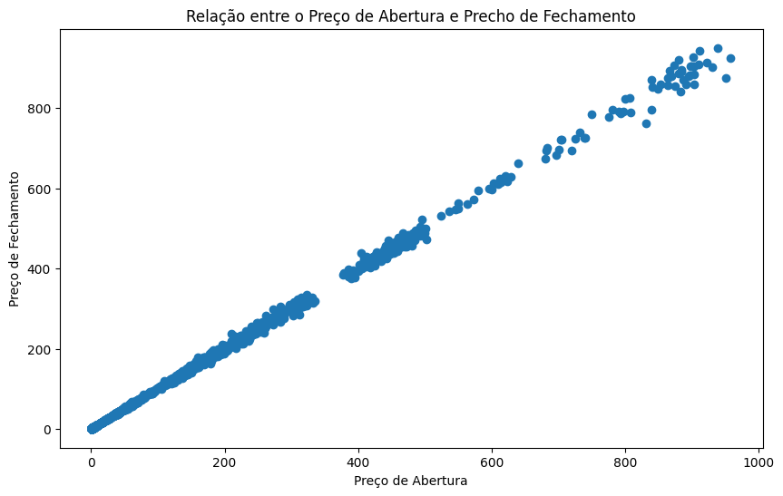
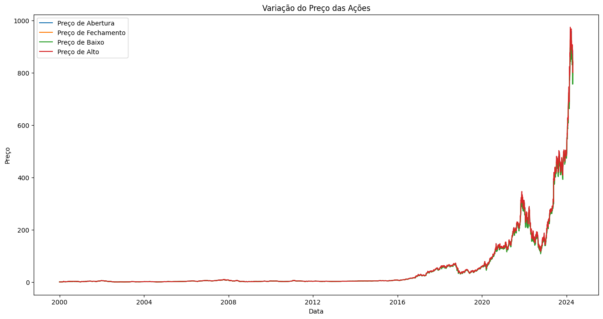
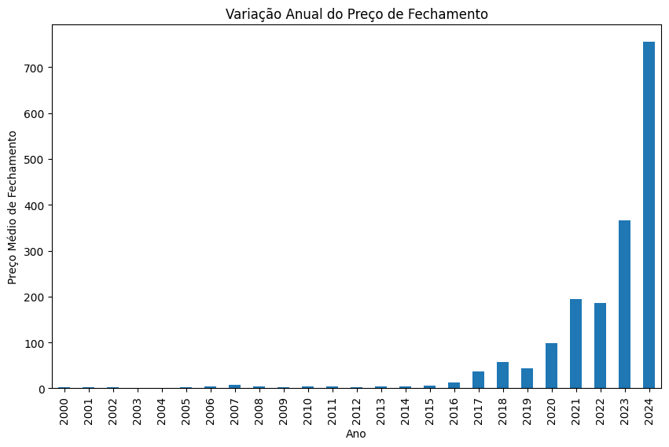
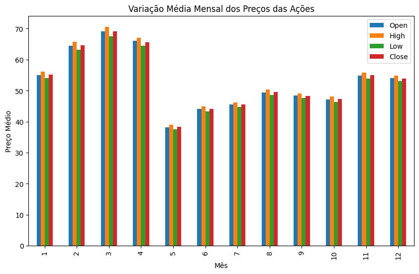

# Análise Exploratória do Projeto: Previsão de Preços de Ações da NVIDIA

## Objetivo da Análise Exploratória

A **análise exploratória dos dados (EDA)** tem como objetivo entender a **distribuição dos dados**, identificar **padrões temporais**, verificar **relações entre variáveis** e detectar **anomalias** que podem afetar a modelagem. Para o projeto de previsão de preços das ações da **NVIDIA**, essa análise tem como foco examinar os preços históricos das ações e as variáveis associadas, como volume de negociações, preços de abertura, fechamento, máximo e mínimo.

1. Qual é a relação entre o preço de abertura (Open) e o preço de fechamento (Close) das ações da NVIDIA?

    **Objetivo**: Avaliar se há uma correlação entre o preço de abertura e o fechamento das ações. Isso pode ajudar a entender se o preço de fechamento geralmente segue o preço de abertura ou se existem grandes variações ao longo do dia.

2. Como o preço das ações (Open, High, Low, Close) varia ao longo do tempo?

    **Objetivo**: Verificar as tendências e padrões de preços ao longo do tempo. Isso pode ser feito por meio de gráficos de linhas, mostrando as flutuações diárias e identificando possíveis tendências de alta ou baixa.

3. Como os preços de fechamento (Close) variam ao longo dos anos?

    **Objetivo**: O objetivo desta análise é observar como o preço de fechamento das ações da NVIDIA variou ao longo dos anos. Ao agrupar os dados por ano e calcular a média do preço de fechamento para cada período, podemos identificar tendências de longo prazo, como anos de grande valorização ou queda das ações. Essa visão é fundamental para entender o comportamento histórico das ações e pode auxiliar na previsão de tendências futuras, além de fornecer insights sobre a estabilidade ou volatilidade da empresa ao longo do tempo.

4. Existe alguma sazonalidade ou padrão específico nas variações diárias de preço (Open, High, Low, Close) em determinados meses ou anos?

      **Objetivo**: Analisar possíveis padrões sazonais ou ciclos no comportamento do preço das ações. Isso pode incluir períodos de alta ou baixa no mercado, como durante o final do ano ou após eventos específicos.

## 1- Qual é a relação entre o preço de abertura (Open) e o preço de fechamento (Close) das ações da NVIDIA?

**Explicação do Gráfico**:

O gráfico de dispersão mostra uma relação quase perfeita entre os preços de abertura (Open) e os preços de fechamento (Close) das ações da NVIDIA. A disposição dos pontos em uma linha reta indica que, à medida que o preço de abertura aumenta, o preço de fechamento tende a aumentar de maneira muito próxima. A correlação calculada entre essas duas variáveis foi de aproximadamente 0.9996, o que sugere uma correlação extremamente forte e positiva.

**Resultado**:

A correlação entre Open e Close foi calculada e revelou um valor muito alto, indicando que os preços de abertura e fechamento das ações da NVIDIA seguem praticamente a mesma tendência. Isso sugere que, na maioria dos dias, o comportamento do preço de fechamento está diretamente relacionado ao preço de abertura.

## 2- Como o preço das ações (Open, High, Low, Close) varia ao longo do tempo?

**Explicação do Gráfico**:

O gráfico de linhas apresenta a variação dos preços de High (preço mais alto) e Low (preço mais baixo) das ações da NVIDIA ao longo do tempo. É possível observar uma leve tendência de crescimento nas primeiras décadas, com um aumento substancial nos preços a partir de 2020 até 2024. Esse aumento acentuado pode ser atribuído a eventos específicos no mercado ou a momentos de alta valorização das ações da empresa.

O gráfico também mostra uma volatilidade considerável em determinados períodos, especialmente nos últimos anos, refletindo a intensa flutuação dos preços, com picos e quedas abruptas.

**Resultado**:

O gráfico revela que as ações da NVIDIA apresentaram um crescimento expressivo desde 2020, com uma valorização acelerada até 2024. Antes desse período, os preços se mantiveram relativamente estáveis, sem grandes variações, o que pode ser característico de uma fase de maturação da empresa. A volatilidade maior no final do período analisado indica um comportamento dinâmico do mercado, possivelmente relacionado a fatores internos e externos que impactaram a empresa.

## 3- Como os preços de fechamento (Close) variam ao longo dos anos?

**Explicação do Gráfico**:

O gráfico de barras mostra a variação média anual do preço de fechamento das ações da NVIDIA. A partir da visualização, é possível observar que o preço das ações foi relativamente estável até 2016, com um aumento gradual nos anos seguintes. A partir de 2020, no entanto, os preços dispararam de maneira significativa, com uma valorização expressiva até 2024. Esse crescimento acentuado pode ser atribuído a fatores específicos do mercado e da empresa, como inovações, aumento de demanda ou outros eventos que impactaram a cotação das ações.

**Resultado**:

A análise mostra uma forte tendência de valorização das ações da NVIDIA a partir de 2020, com um aumento drástico no preço de fechamento em 2024. Isso sugere um período de crescimento acelerado, possivelmente impulsionado por mudanças no mercado, inovação tecnológica ou outros fatores que afetaram diretamente o preço das ações. Antes disso, os preços se mantiveram relativamente estáveis, indicando um período de maturação da empresa.

## Existe alguma sazonalidade ou padrão específico nas variações diárias de preço (Open, High, Low, Close) em determinados meses ou anos?

