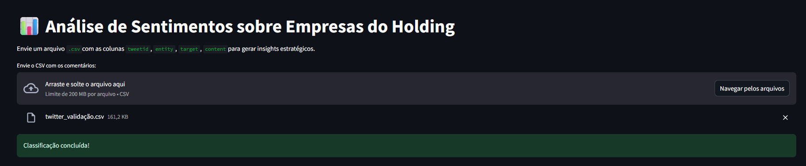
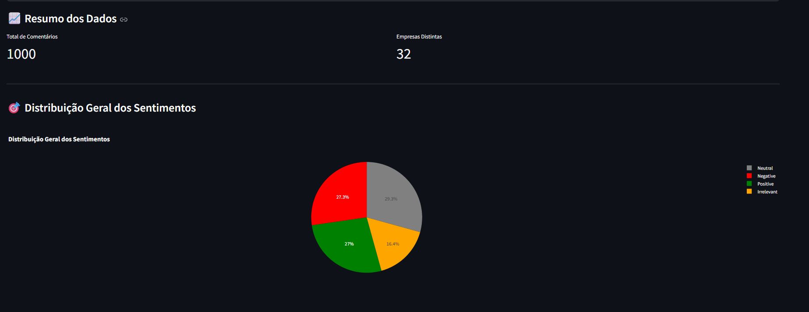
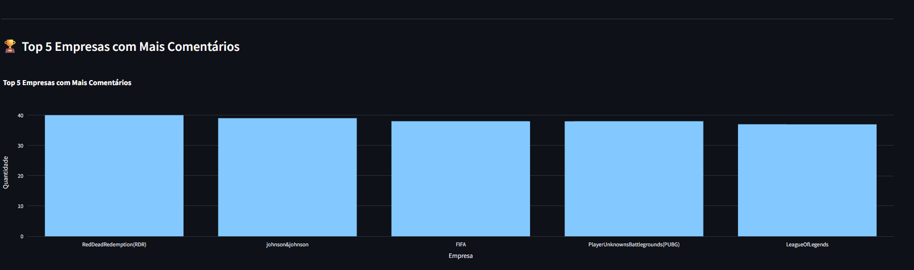
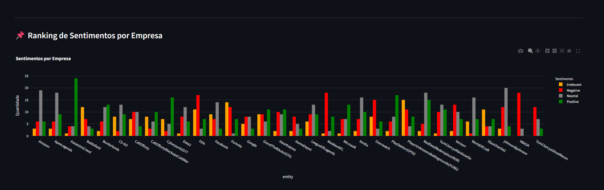
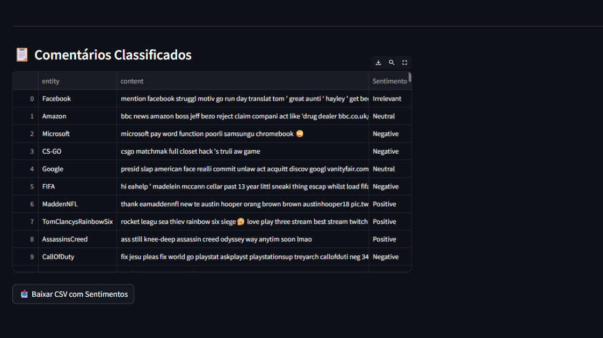

# Análise de Sentimentos do Twitter - Holding de Empresas

Esta aplicação realiza uma análise automática de sentimentos com base em comentários de redes sociais, utilizando Processamento de Linguagem Natural (PLN) e Aprendizado de Máquina. O objetivo é fornecer insights estratégicos para holdings que desejam monitorar a percepção de suas empresas no ambiente digital.

## 🌐 Tecnologias Utilizadas

* Python 3
* Streamlit
* Scikit-learn
* NLTK
* Plotly

## 📆 Estrutura do Projeto

```bash
Natural-Language-Processing/
├── app/
│   ├── app.py               # Interface com Streamlit para envio de CSV e visualização dos resultados
│   ├── utils.py             # Funções de pré-processamento e tratamento do CSV
├── models/
│   ├── extra_tress.pkl      # Modelo treinado para classificação de sentimentos
│   ├── model_vectorizer_tfidef.pkl  # Modelo vectorizer 
│   ├── label_encoder.pkl    # Modelo label
├── data/                   # Exemplos de arquivos CSV para treino e validação
│   ├── twitter_training.csv     # Arquivo usado para treinamento dos modelos
│   ├── twitter_validation.csv   # Arquivo usado para validação do modelo e teste na aplicação
├── reports/                # Relatórios e análises do projeto
│   ├── conclusao_extra_tress.md   # Métricas e validação do modelo ETS
│   ├── conclusao_random_forest.md   # Métricas e validação do modelo RF
│   ├── conclusao_geral_final.md     # Conclusões e insights estratégicos
└── README.md               # Este documento
```

## 🔍 Objetivo

Permitir que um profissional de marketing ou análise de dados envie um arquivo CSV com comentários do Twitter e visualize:

* A distribuição de sentimentos
* O ranking das empresas mais comentadas
* A classificação dos sentimentos por empresa
* Os comentários classificados automaticamente por ML

## 📋 Formato do Arquivo CSV de Entrada

O arquivo deve conter as seguintes colunas:

* `tweetid` (opcional, removido internamente)
* `entity`: Nome da empresa mencionada
* `target`: Sentimento original (opcional, removido)
* `content`: Texto do comentário

## 🚀 Como Utilizar

1. Clone o repositório e instale as dependências
2. Execute o Streamlit:

```bash
cd app
streamlit run app.py
```

3. Envie o CSV contendo os comentários para classificação
4. Explore os gráficos e faça o download do resultado classificado

## 🌟 Funcionalidades Adicionais

* Filtro dinâmico por empresa para análise individual
* Cores fixas por sentimento:

  * Positivo: Verde
  * Negativo: Vermelho
  * Neutro: Cinza
  * Irrelevante: Laranja
* Download do CSV rotulado com as predições do modelo

## Interface de Aplicação 🌐











## 🔬 Sobre o Modelo

O modelo utilizado é do tipo *ExtraTreesClassifier* treinado com TF-IDF. Foi avaliado com ótima performance em um conjunto de validação, alcançando **96% de acurácia**.

## 🔄 Possíveis Extensões Futuras

* Deploy via Docker
* Disponibilização como API REST com FastAPI
* Uso de LLMs para explicação textual das classificações

## 🙏 Agradecimentos

Este projeto é uma extensão do estudo realizado com o dataset do Kaggle [Twitter Entity Sentiment Analysis](https://www.kaggle.com/datasets/jp797498e/twitter-entity-sentiment-analysis).

---

Desenvolvido com propósito educacional e aplicado para experiências realistas de negócios e dados.
