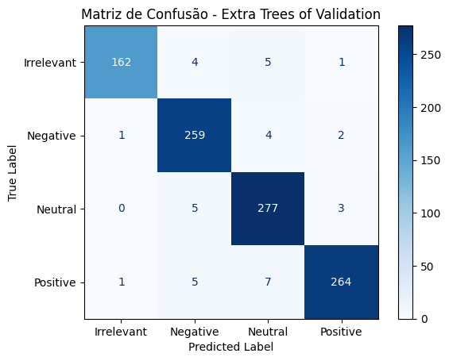

# README - Projeto de Análise de Sentimentos em Comentários do Twitter

Este projeto tem como objetivo realizar a análise de sentimentos de comentários sobre empresas de um holding, coletados do Twitter. Utilizando técnicas de Processamento de Linguagem Natural (PLN), classificamos os sentimentos como positivos, negativos ou neutros, com o objetivo de oferecer insights valiosos para decisões de marketing e monitoramento de marca.

## 📊 Fluxo Geral do Projeto

1. **Coleta de Dados**
   
   - Utilizando dados da plataforma Kaggle: [Análise de sentimento do Twitter](https://www.kaggle.com/datasets/jp797498e/twitter-entity-sentiment-analysis/code)..
   - Extração de tweets com menções a empresas específicas, contendo dados como texto, data, e hashtags, possuindo 74.782 Dados.

2. **Pré-processamento dos Dados**
   
   - Limpeza de texto: remoção de stopwords, URLs, menções a usuários, e caracteres especiais.
   - Tokenização e lematização para preparar o texto para análise.
   - Conversão dos dados textuais em um formato adequado para os modelos de aprendizado de máquina (ex.: Vetorização usando TF-IDF).

3. **Análise Exploratória de Dados (EDA)**
   
   - Visualização de dados: gráficos de distribuição de sentimentos, análise de palavras mais frequentes e hashtags mais utilizadas.
   - Cálculo da distribuição de sentimentos para entender a prevalência de cada classe (positivo, negativo, neutro).

4. **Construção do Pipeline Base**
   
   - Utilização do pipeline com **TF-IDF Vectorizer** + **Modelo de Classificação** (**ExtraTreesClassifier** e **RandomForestClassifier**).
   

5. **Avaliação e Interpretação do Modelo**
   
   - Avaliação de métricas como **Acurácia**, **Precisão**, **Recall**, **F1-score**.
   - Gráficos de avaliação, como **Matriz de Confusão** e **Curva ROC** para visualizar a performance do modelo.

| Modelo                  | Acurácia  | Precisão 0 | Precisão 1 | Precisão 2 | Precisão 3 | Recall 0  | Recall 1  | Recall 2  | Recall 3  |
| ----------------------- | --------- | ---------- | ---------- | ---------- | ---------- | --------- | --------- | --------- | --------- |
| Random Forest           | 0.934502  | 0.935001   | 0.935001   | 0.935001   | 0.935001   | 0.934502  | 0.934502  | 0.934502  | 0.934502  |
| ExtraTreesClassifier    | 0.939759  | 0.940437   | 0.940437   | 0.940437   | 0.940437   | 0.939759  | 0.939759  | 0.939759  | 0.939759  |

**Conclusão**: O **ExtraTreesClassifier** apresentou o melhor desempenho geral, com maior acurácia e valores consistentes de precisão e recall em todas as classes.

6. **Validação dos Modelos**

   
   - O modelo Random Forest alcançou uma acurácia de 95.6%, enquanto o Extra Trees obteve 96.2%, com métricas de F1-score, precisão e recall consistentemente acima de 0.95 para todas as classes. Isso indica que ambos os modelos são altamente confiáveis para classificar sentimentos em textos do Twitter, com destaque para o Extra Trees em termos de precisão nas classes Positive e Neutral.

 ### [Validação da Matriz de Confusão do Random Forest Of Validation](../images/matriz_of_confusion_random_forest.png)

 

 > O modelo Random Forest apresentou desempenho excelente na tarefa de classificação de sentimentos, com métricas consistentes e erros baixos. Apesar de pequenas confusões entre classes subjetivamente próximas, ele está pronto para uso real e pode ser facilmente integrado a um sistema de análise de sentimentos, com potencial de melhora por meio de vetores semânticos e técnicas modernas de PLN.

### [Validação da Matriz de Confusão do ExtraTressClassifier](../reports/conclusao_extra_trees.md)

> O modelo Extra Trees demonstrou performance excepcional em classificação de sentimentos com PLN. Com métricas superiores a 96% em todas as dimensões e erros muito controlados, ele se apresenta como uma das melhores opções para deploy imediato, mantendo precisão, robustez e generalização.

 ## ✅ [Conclusão Final](../reports/conclusao_geral_final.md) 

Percebe-se que esse dataframe possui quatro classes de sentimentos: *Neutro*, *Irrelevante*, *Positivo* e *Negativo*. Determinados modelos conseguiram prever essas quatro classes com excelentes resultados, como mostrado nas avaliações do Random Forest e do Extra Trees.

O modelo **Random Forest** alcançou uma acurácia de **95.6%**, enquanto o **Extra Trees** obteve **96.2%**, com métricas de F1-score, precisão e recall consistentemente acima de 0.95 para todas as classes. Isso indica que ambos os modelos são altamente confiáveis para classificar sentimentos em textos do Twitter, com destaque para o Extra Trees em termos de precisão nas classes *Positive* e *Neutral*.

A análise da matriz de confusão revelou que as maiores confusões ocorrem entre as classes *Neutral* e *Positive*, o que é esperado em tarefas de PLN, dado o conteúdo subjetivo e o tom ambíguo de muitos comentários. Apesar disso, os erros são relativamente baixos e não comprometem a performance geral do modelo.
---

Este projeto exemplifica como é possível aplicar técnicas de PLN e aprendizado supervisionado para análise de sentimentos em grandes volumes de dados não estruturados, como tweets, proporcionando insights valiosos para o monitoramento de marcas e campanhas de marketing.
