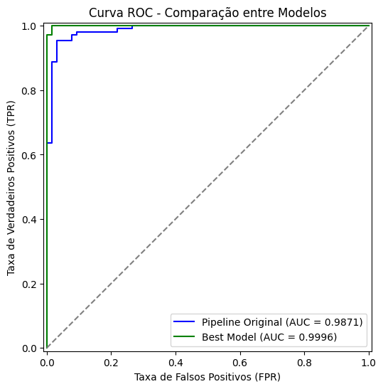
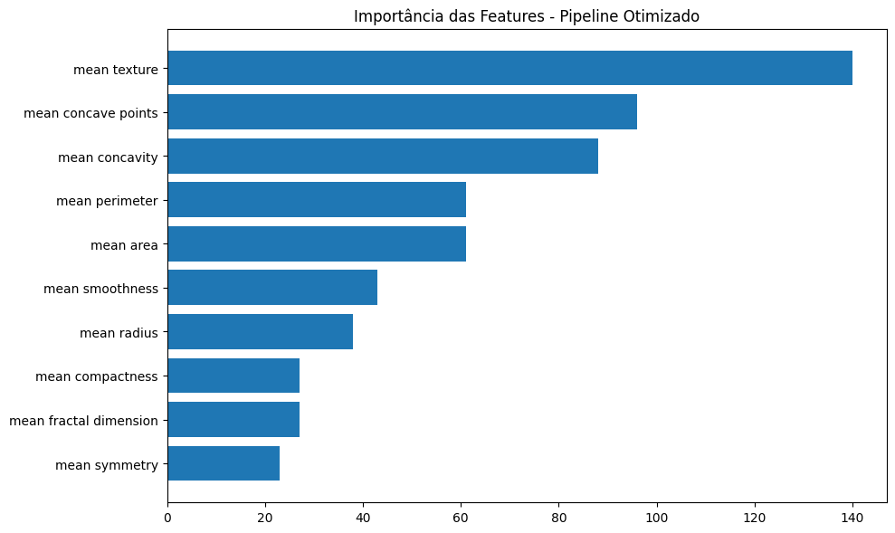

# README - Notebook de Classificação de Neoplasias

Este notebook apresenta um estudo detalhado sobre a **classificação de neoplasias (tumores)** utilizando técnicas de Machine Learning, com foco especial no modelo **LightGBM Classifier**. O objetivo principal foi distinguir tumores benignos de malignos com alta acurácia e robustez, garantindo aplicação realista e confiável para cenários clínicos.

## 📊 Fluxo Geral do Notebook

1. **Leitura e Análise Exploratória dos Dados**

   * Fonte: `cancer.csv` com 569 registros e 32 atributos.
   * Divisão dos atributos em três grupos: `mean`, `worst`, `error`.
   * Gráficos de distribuição e correlação mostraram forte multicolinearidade entre algumas features.

2. **Engenharia de Atributos**

   * Inicialmente, todos os atributos foram utilizados para o treinamento.
   * Discussão crítica sobre a disponibilidade real dos atributos no cenário clínico.
   * Redução de atributos com base em importância e SelectFromModel (threshold='median').

3. **Construção do Pipeline Base**

   * Uso do `Pipeline` com `StandardScaler` + `LGBMClassifier`.
   * Validação cruzada com `cv=5` retornando média de **0.94 a 0.95** de acurácia.

4. **Ajuste de Hiperparâmetros com GridSearchCV**

   * Parâmetros otimizados:

     ```python
     {
       'lgbm__learning_rate': 0.1,
       'lgbm__max_depth': 5,
       'lgbm__min_child_samples': 10,
       'lgbm__n_estimators': 200,
       'lgbm__num_leaves': 15
     }
     ```
   * Novo modelo atingiu **acurácia de 99%** e **F1 Score de 0.96** no conjunto de teste.

5. **Avaliação e Interpretação do Modelo**

   * Comparativo entre pipeline original e modelo ajustado com GridSearch.

   * Gráfico ROC Curve gerado com AUC > 0.99:

     

   * Importância dos atributos plotada via `plot_importance()`:

     

6. **Detecção de Overfitting**

   * Avaliação inicial com 100% de acurácia em treino e < 95% em teste confirmou overfitting.
   * Melhor modelo apresenta desempenho equilibrado:

     ```
     Acurácia - Treinamento: 0.9824
     Acurácia - Teste: 0.9883
     ```

## ✅ Conclusões Técnicas

* **O modelo LightGBM é altamente eficaz** para classificação binária neste tipo de problema.
* A **redução de atributos** com base em importância pode melhorar generalização e performance.
* A aplicação de **validação cruzada** e **tuning de hiperparâmetros** são fundamentais para evitar overfitting.

### 📊 Comparativo Final: Pipeline Original vs Modelo Otimizado

A tabela a seguir resume as principais métricas entre os dois modelos testados:

| Métrica             | Pipeline Original | Modelo Otimizado |
| ------------------- | ----------------- | ---------------- |
| Acurácia (treino)   | 1.0000            | 0.9824           |
| Acurácia (teste)    | 0.9474            | 0.9883           |
| ROC AUC             | 0.9871            | 0.9996           |
| F1-Score (Classe 0) | 0.9302            | 0.9844           |
| F1-Score (Classe 1) | 0.9577            | 0.9907           |

**Conclusão**: o modelo otimizado apresentou melhor equilíbrio entre treino e teste, maior capacidade de generalização e superou todas as métricas comparativas. Portanto, é o mais recomendado para produção.

---

Este notebook representa um exemplo robusto de aplicação de aprendizado supervisionado para problemas de saúde, com validação estatística, visualização gráfica e alta capacidade preditiva.
