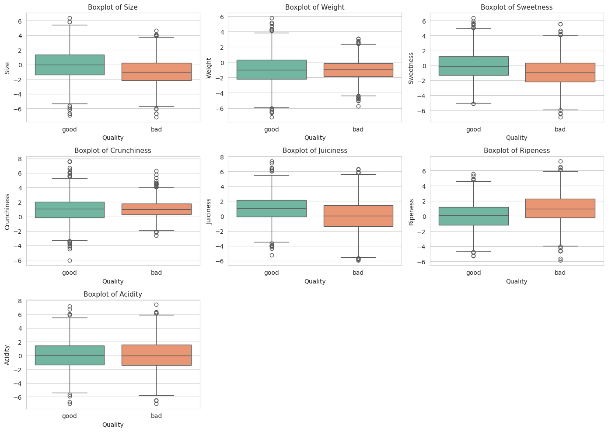
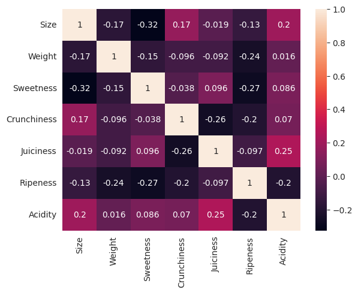
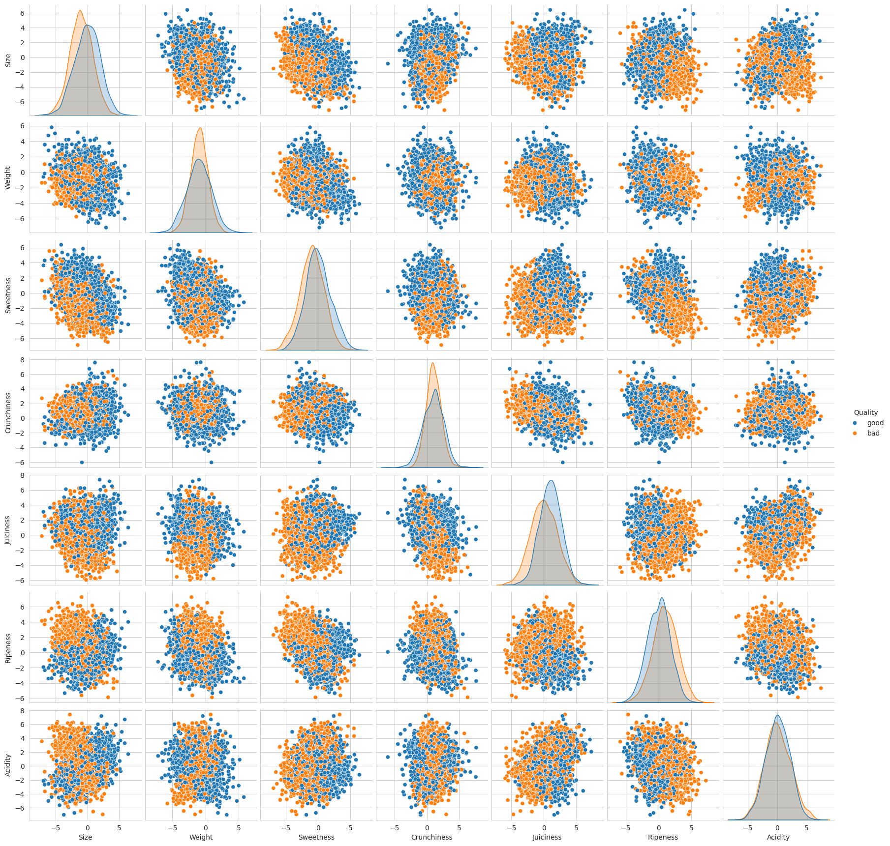

# 📊 Análise Exploratória dos Dados de Qualidade de Frutas

## 🔎 Boxplots por Qualidade

Os **boxplots** mostram a distribuição das variáveis em relação à qualidade das frutas (`good` e `bad`). Algumas observações relevantes:

- **Size e Weight**: frutas classificadas como `good` tendem a apresentar valores ligeiramente maiores de tamanho e peso, embora exista sobreposição com as frutas `bad`.
- **Sweetness**: há maior concentração de doçura nas frutas `good`, enquanto as `bad` possuem valores mais baixos e dispersos.
- **Juiciness e Ripeness**: frutas boas apresentam maior tendência a serem mais suculentas e maduras.
- **Acidity**: frutas `bad` mostram tendência a níveis mais altos de acidez, o que pode estar associado à pior qualidade percebida.

➡️ Esses padrões sugerem que variáveis como **Sweetness, Juiciness, Ripeness e Acidity** podem ser fatores importantes na diferenciação da qualidade.

---

## 📈 Matriz de Correlação

A matriz de correlação revela a força da relação linear entre as variáveis:

- Correlações **fracas a moderadas** foram observadas, como entre:
  - `Sweetness` e `Size` (-0.32), sugerindo que frutas maiores não são necessariamente mais doces.
  - `Juiciness` e `Acidity` (0.25), indicando que frutas mais suculentas tendem a ser um pouco mais ácidas.
  - `Ripeness` e `Sweetness` (-0.27), sugerindo que frutas mais maduras tendem a apresentar menor doçura.
- No geral, **não existem correlações muito fortes** (>0.7), o que sugere que cada variável pode contribuir de forma independente para o modelo.

---

## 🔀 Pairplot (Distribuição Bivariada)

O **pairplot** mostra a relação entre cada par de variáveis com a qualidade (`good` e `bad`):

- A sobreposição entre as classes é alta, indicando que **nenhuma variável isolada é suficiente para separar as classes**.
- No entanto, a combinação de múltiplos atributos pode ajudar o modelo a aprender padrões:
  - `Sweetness` e `Ripeness` apresentam separação parcial entre classes.
  - `Juiciness` também contribui, com frutas boas mais concentradas em valores positivos.
- O padrão indica que **modelos baseados em árvores** (Random Forest, XGBoost, Extra Trees) são adequados, pois conseguem capturar essas interações não lineares.

---

## ✅ Conclusão da Análise Exploratória

- As frutas `good` tendem a ser **mais doces, suculentas e maduras**, além de menos ácidas.
- As variáveis são **pouco correlacionadas entre si**, o que aumenta a relevância de combiná-las em modelos preditivos.
- Visualmente, não existe uma separação clara entre as classes em gráficos univariados, reforçando a necessidade de **modelos de machine learning capazes de aprender interações complexas** entre as features.

Esses insights extraídos da análise de dados servem como base para a construção e interpretação dos modelos preditivos.

