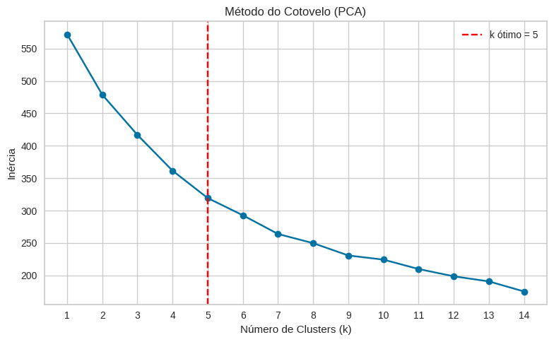

# 🌱 Agrupamento de Municípios Paraenses com Dados Ambientais

Este projeto propõe a análise e agrupamento dos municípios do estado do Pará com base em múltiplos indicadores ambientais e socioeconômicos. A iniciativa foi desenvolvida como parte de um desafio técnico da **I2A2 – Instituto de Inteligência Artificial Aplicada**, com o objetivo de aplicar técnicas de aprendizado não supervisionado para extrair padrões ocultos e subsidiar futuras tomadas de decisão ambiental, social e territorial.

---

## 📊 Sobre o Dataset

O conjunto de dados utilizado contém **informações ambientais e socioeconômicas de municípios paraenses**, com as seguintes variáveis:

- **Índice de Desmatamento (%)**
- **Cobertura Vegetal (%)**
- **Acesso à Água Potável (%)**
- **Renda Média Mensal (R$)**
- **Densidade Populacional (hab/km²)**
- **Frequência de Queimadas (ano)**
- **Distância de Área Urbana (km)**

Essas variáveis refletem diferentes aspectos da realidade dos municípios e permitem análises multivariadas com o intuito de compreender seus padrões comuns e divergentes.

---

## 🎯 Problema

Como agrupar municípios com características semelhantes, considerando múltiplos fatores ambientais e sociais, de forma a facilitar a análise de políticas públicas e estratégias de intervenção?

Para isso, utilizamos **técnicas de clusterização**, que permitiram identificar **grupos de municípios com perfis semelhantes** sem a necessidade de rótulos prévios.

---

## 🧠 Metodologia

1. **Pré-processamento dos dados**  
   - Limpeza e padronização
   - Padronização por `StandardScaler`
   - Redução de dimensionalidade com **PCA** (5 componentes principais)

2. **Clusterização com K-Means**  
   - Utilização do **Gráfico de Cotovelo (Elbow Method)** para identificar o número ideal de clusters
   - Agrupamento dos municípios com base nos componentes principais

3. **Visualizações e Análise dos Resultados**  
   - Heatmap e gráficos comparativos por cluster
   - Exportação dos clusters em `.csv` para posterior análise

---

## 📈 Resultados

- Foram encontrados **4 clusters distintos** com características ambientais e socioeconômicas diferentes.
- A análise evidenciou, por exemplo:
  - Municípios com maior densidade populacional e menor cobertura vegetal agrupados.
  - Grupos com maior renda média mensal e acesso à água potável destacando regiões urbanizadas.
  - Clusters com alta frequência de queimadas associados a menor cobertura vegetal e maior desmatamento.

### 📈 Escolha do Número de Clusters (Elbow Method)

Para determinar a quantidade ideal de grupos (K) no algoritmo K-Means, utilizamos o método do cotovelo (*Elbow Method*), que avalia a inércia intra-cluster para diferentes valores de K.

A curva abaixo mostra que a partir de **K = 3**, a redução de inércia passa a ser marginal, indicando um ponto de equilíbrio ideal entre complexidade e desempenho.




---

## 🗂️ Estrutura do Projeto

```
classification-neoplasias/
├── data/
│ ├── raw/              # Dados brutos originais
│ │ └── municipios_para.csv
│ └── refined/          # Dados tratados com clusters
│ └── municipios_clusterizados.csv
│
├── models/             # Modelos de machine learning treinados
│ └── kmeans_model.pkl
│
├── notebook/           # Notebooks Jupyter com análise e modelagem
│ └── clustering_i2a2.ipynb
│
├── reports/
│ ├── images/           # Gráficos e imagens utilizadas no relatório
│ │ 
│ └── sites/            # Versão HTML do notebook para visualização externa
│
├── src/                # Scripts de processamento e modelagem
│ ├── preprocessing.py
│
└── README.md # Documentação principal do projeto

```

## ✅ Conclusão

Este projeto demonstrou o potencial da análise de agrupamento para entender padrões regionais complexos. Ao aplicar o algoritmo K-Means sobre variáveis ambientais e socioeconômicas, foi possível gerar insights valiosos sobre os diferentes perfis de municípios paraenses.

A solução pode ser usada para **priorizar ações ambientais**, **avaliar risco socioambiental** ou **segmentar políticas públicas** com base em dados reais e estruturados.
